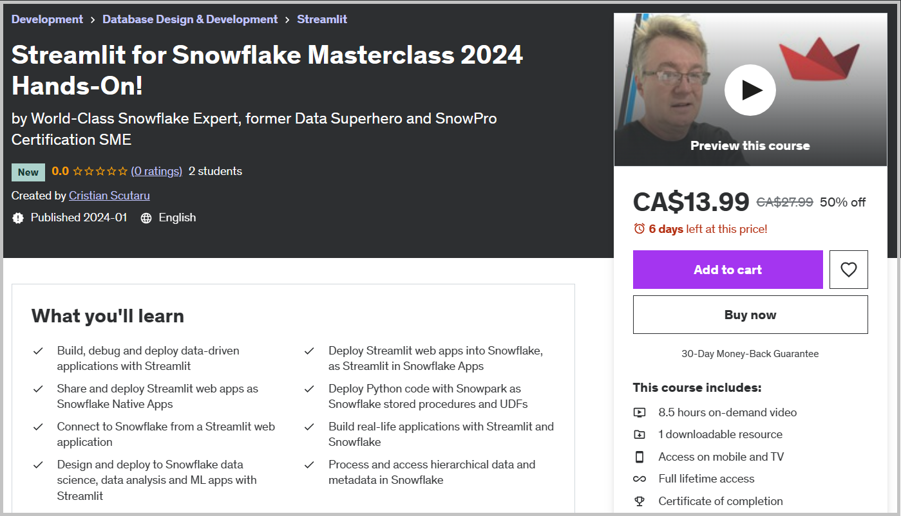
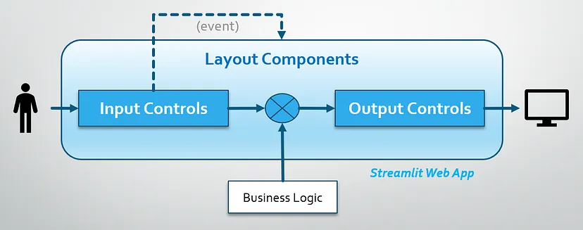
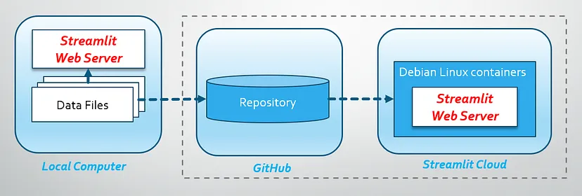

# Streamlit for Snowflake

All demo code for my Udemy course [**Streamlit for Snowflake Masterclass 2024 Hands-On!**](https://www.udemy.com/course/streamlit-for-snowflake/?couponCode=BEST-PRICE). Refer to individual sections for local documentation.

## My Promo Video

## (1) Testing Local Streamlit Web Apps

This first section is an end-to-end bootcamp on **Streamlit**.

All applications will be deployed and tested as local Streamlit web apps. I’ll focus on the front-end architecture and walk over all possible Streamlit controls and components you need to know about, including data caching and the session state.

## (2) Sharing Streamlit Web Apps in Streamlit Cloud

Learn how to deploy and share local Streamlit web apps in the **Streamlit Community Cloud**.

No connection to Snowflake yet, but we’ll continue to expand and deploy an exciting Hierarchical Data Viewer app on CSV tabular data, that will contain most elements of any data-driven application.

## (3) Connecting Streamlit Apps to Snowflake

I’ll introduce the different ways you can connect from Streamlit to Snowflake, including several specific examples on using each API:

* **SnowSQL** — with SQL script execution.
* **Snowflake Connector for Python** — with typical client applications.
* **Snowpark for Python** — with DataFrame API and stored proc decorators.
* **Streamlit Connector for Snowflake** — with secrets and login forms.

## (4) Deploying Streamlit Apps to Snowflake

We’ll focus on the two major brand new and revolutionary frameworks in Snowflake, deploying several Streamlit apps in each of them:

* **Streamlit in Snowflake Apps** — in your Snowflake account.
* **Snowflake Native Apps** — shared with other Snowflake accounts.

